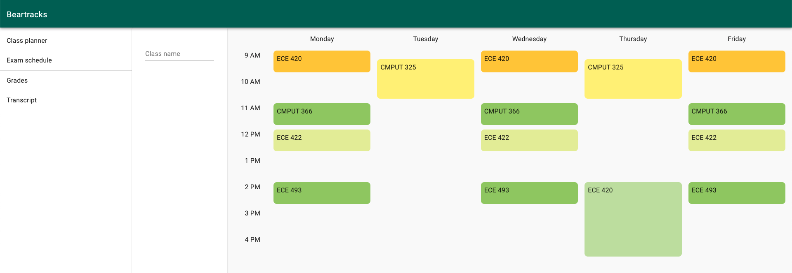

# beartracks-v2

<p align="center">
  
</p>

Schedule and manage your classes quickly using **beartracks-v2**

## Getting started

To run the full stack in development mode

1. Rename `./client/.env.sample` to `./client/.env`

2. Run the following commands in two separate terminals

```bash
cd ./client
npm start
```

```bash
cd ./server
go run .
```

Then visit `http://localhost:3000` in your browser
